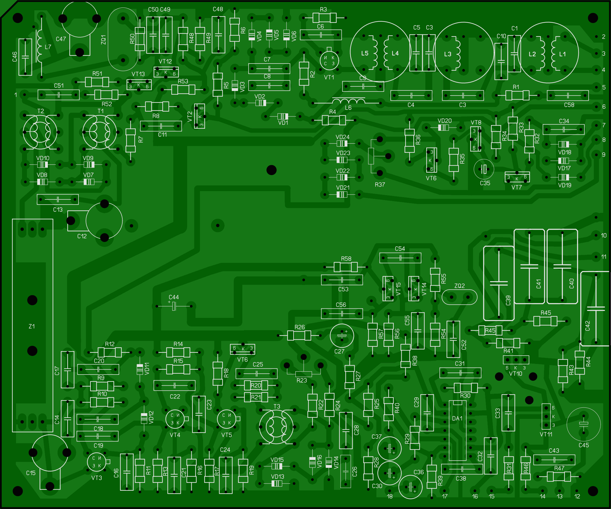

# Реплика радиоприемника «Карпаты»

Проект по оцифровке материалов и доработке радилюбительского КВ-приемника «Карпаты», опубликованного в журнале «Радио» (№11-12 за 1987 год).

## 📌 О проекте
Цель проекта — оцифровать печатные платы для сборки радипориемника, упростить возможность модификации печатных плат под имеющиеся радиокомпоненты.
* **Авторы приемника:** Ю. Бахмутский (UB4LGP), В. Калаев (RB5LEN)
* **Первоисточник:** Журнал «Радио», [№11 1987 г. (стр. 31–33)](http://archive.radio.ru/web/1987/11/), [№12 1987 г. (стр. 19–21, вкл. 2-3)](http://archive.radio.ru/web/1987/12/).
* **Технологии:** Sprint-Layout 6.0.

## 📂 Структура репозитория
* `/docs/original-articles/` — оригинальные сканы страниц журнала в формате JPG.
* `/sch/` — принципиальные электрические схемы.
* `/pcb/` — файлы печатных плат.
* `/pcb/img` — изображения печатных плат.

## 🛠 Технические подробности
Печатные платы оптимизированы под домашнее производство с помощью ЛУТ: крупные контактные площадки, толстые дорожки, минимальный диаметр отверстий - 0,8 мм. 

**Внимание!**  Шелкография для диодов КД522Б соотвествует их внешнему виду, то есть широкая полоса обозначает **анод**. При установке диодов 1N4148 необходимо учитывать, что полоска на корпусе диода указывет на **катод**.

## ✅ Статус оцифровки печатных плат

Нажмите на изображение платы, чтобы перейти к файлу в формате `.lay6`.

### Плата №6 (Основная плата)
Центральный блок приемника, содержащий второй смеситель, тракт ПЧ, опорные генераторы, АРУ, детектор и УНЧ.

---
*Проект находится в стадии наполнения.*