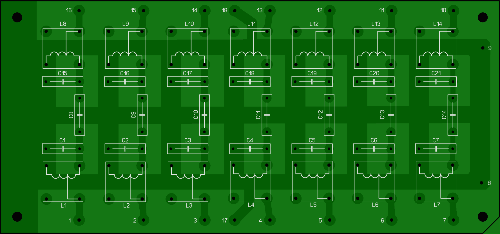
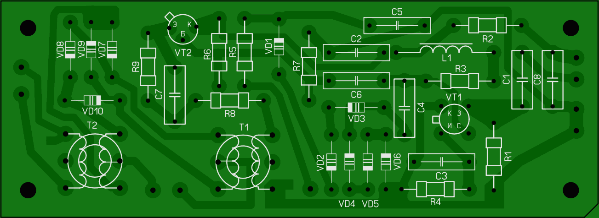
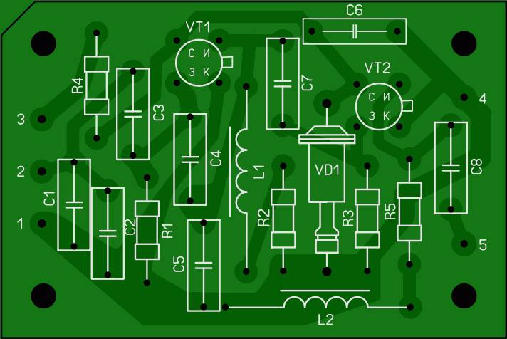
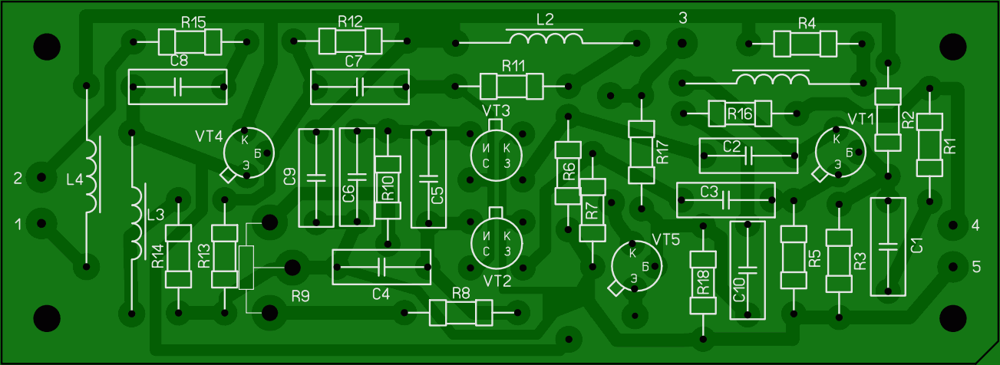
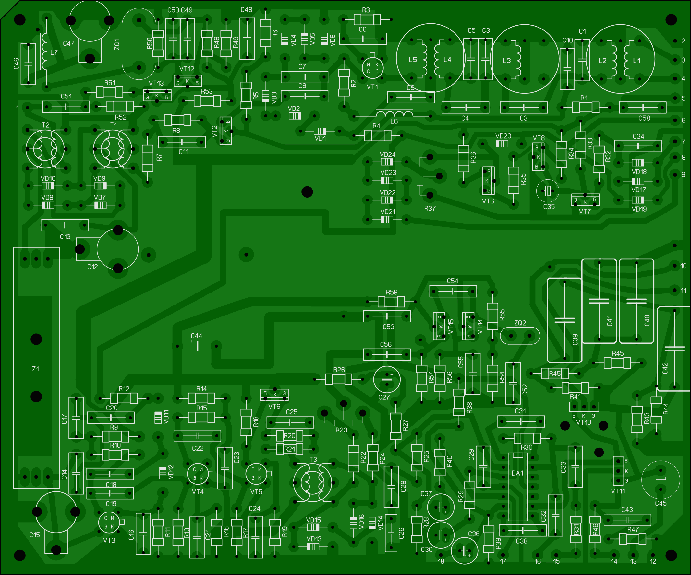
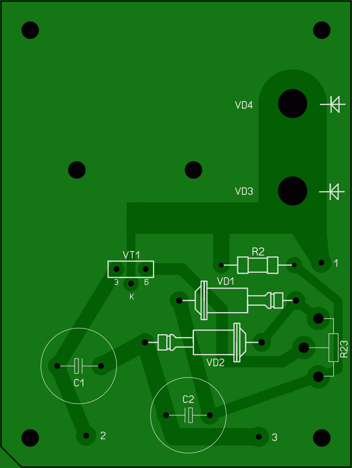
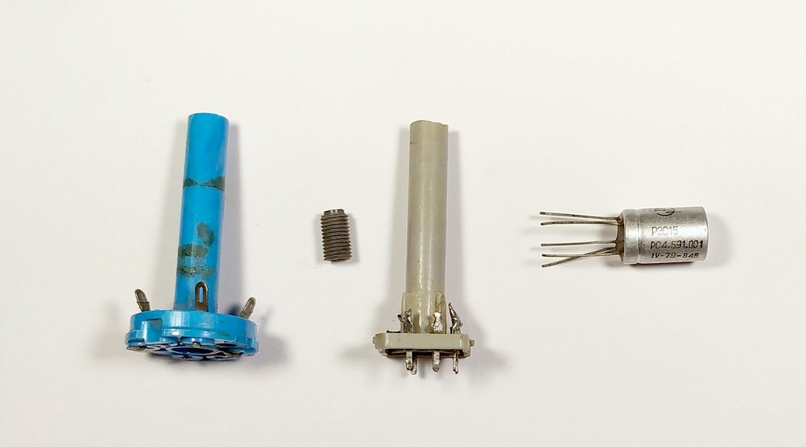
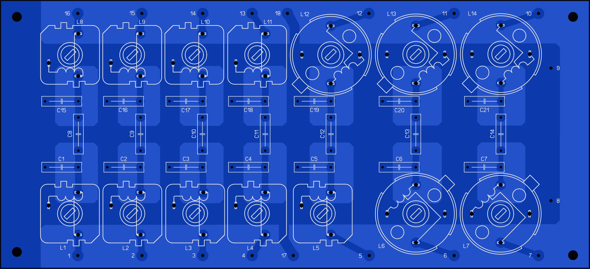
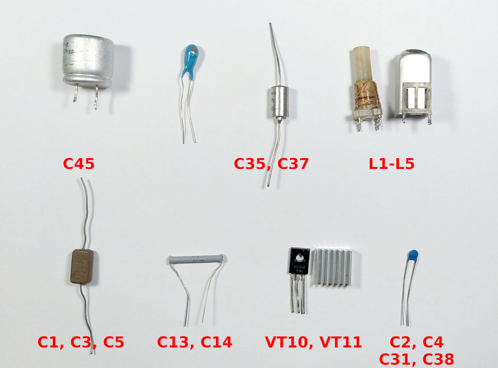
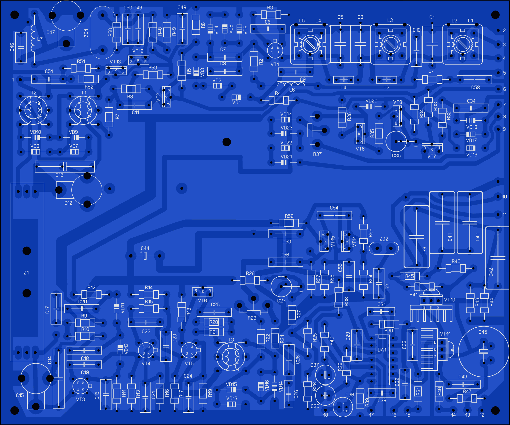

# Реплика радиоприемника «Карпаты»

Проект по оцифровке материалов и доработке радилюбительского КВ-приемника «Карпаты», опубликованного в журнале «Радио» (№11-12 за 1987 год).

## 📌 О проекте
Цель проекта — оцифровать печатные платы для сборки радиоприемника, упростить возможность модификации печатных плат под имеющиеся радиокомпоненты.
* **Авторы приемника:** Ю. Бахмутский (UB4LGP), В. Калаев (RB5LEN)
* **Первоисточник:** Журнал «Радио», [№11 1987 г. (стр. 31–33)](http://archive.radio.ru/web/1987/11/), [№12 1987 г. (стр. 19–21, вкл. 2-3)](http://archive.radio.ru/web/1987/12/).
* **Технологии:** Sprint-Layout 6.0.

## 📂 Структура репозитория
* `/docs/original-articles/` — оригинальные сканы страниц журнала в формате JPG.
* `/sch/` — принципиальные электрические схемы.
* `/pcb/` — файлы печатных плат.
* `/pcb/mod/` — модифицированные файлы печатных плат.
* `/pcb/*/img/` — изображения печатных плат.

## 🛠 Технические подробности
Печатные платы оптимизированы под домашнее производство с помощью ЛУТ: крупные контактные площадки, толстые дорожки, минимальный диаметр отверстий - 0,8 мм. 

**Внимание!**  Шелкография для диодов КД522Б соотвествует их внешнему виду, то есть широкая полоса обозначает **анод**. При установке диодов 1N4148 необходимо учитывать, что полоска на корпусе диода указывет на **катод**.

## ✅ Статус оцифровки печатных плат

Нажмите на изображение платы, чтобы перейти к файлу в формате `.lay6`.

### Плата №1 (ДПФ)
На плате расположены диапазонные фильтры сосредоточенной селекции.

### Плата №2 (УРЧ + первый смеситель)
На плате расположен усилитель радиочастоты, согласующий каскад и первый смеситель.

### Плата №3 (ГПД)
Плата генератора плавного диапазона (ГПД).

### Плата №4
Не является печатной платой. 

Содержит подстроечные и постоянные конденсаторы, задающие границы работы ГПД на диапазонах. 

Элементы монтируются на металлической пластине навесным монтажом.

### Плата №5 (Повторители + удвоитель частоты)
Плата содержит повторители и удвоитель частоты ГПД.

### Плата №6 (Основная плата)
Центральный блок приемника, содержащий второй смеситель, тракт ПЧ, опорные генераторы, АРУ, детектор и УНЧ.

### Плата №7 (Блок питания)
Плата источника питания. Содержит выпрямитель, фильтрующие ёмкости и стабилизатор напряжения.

## 🔧 Модифицированные печатные платы
Модификации оригинальных печатных плат под имеющиеся радиокомпоненты или из других соображений. 

### Плата №1 (ДПФ)
Модификация платы под имеющиеся каркасы контурных катушек. 

Фото каркасов:

Плата:

### Плата №6 (Основная плата)
Модификация платы под имеющиеся радиокомпоненты. 

Список основных изменений:
* заменены посадочные места и шелкогарфия контуров полосового фильтра L1-L5;
* C35, C37: добавлены посадочные места под ниобиевые конденсаторы К53-4;
* C1, C3, C5: добавлены посадочные места под КСО-1;
* С2, С4: добавлены посадочные места под КД-1-3;
* C13, C14: добавлены посадочные места под КТ-2;
* C31, C38 уменьшен размер под дисковый керамический;
* VT10, VT11: добавлены радиаторы и крепеж;
* Удалены отверстия крепления радиатора;
* С45 заменен на К50-6 200 мкФ х 25В, старое посадочное место сохранено.

Фото компонентов:

Плата:

<a href="pcb/mod/img/karpaty-rx-pcb6-mainboard-mod-compare-preview.gif">Анимированное изображение</a> внесённых изменений относительно оригинальной платы.

---
*Проект находится в стадии наполнения.*
